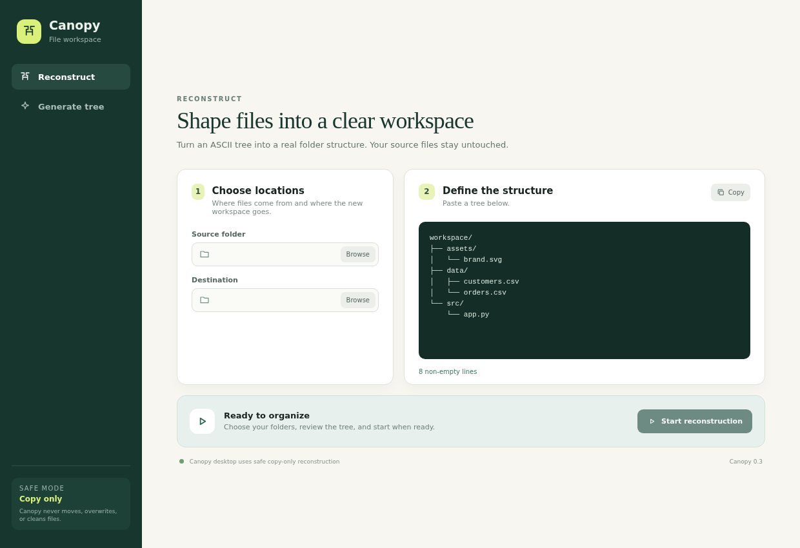

# ASCII Tree Reorganizer & Generator

[](pyproject.toml) [](https://www.python.org/) [](LICENSE)

Turn an ASCII directory tree into a real workspace, or scan a folder into a portable Unicode tree. The Python engine validates the complete destination plan before writing. Copy is the default; move, overwrite, and cleanup require explicit CLI flags.



## Choose an interface

| Interface | Best for | Current scope |
| --- | --- | --- |
| `ascii-tree-reorg` CLI | automation and advanced reconstruction | copy, move, overwrite, cleanup, dry run |
| Canopy desktop | interactive reconstruction and tree generation | safe copy-only reconstruction; generation with files included |

Canopy intentionally does not expose destructive move, overwrite, or cleanup controls. Use the CLI when those options are required.

## Install the CLI

End users with Python 3.9 or newer:

```bash
python -m pip install ascii-tree-reorg
ascii-tree-reorg --help
```

From a source checkout:

```bash
python -m pip install .
```

A safe first run previews the plan without creating an output directory:

```bash
ascii-tree-reorg --tree-file structure.txt \
  --source-dir loose-files \
  --output-root organized-runs \
  --task-name example \
  --dry-run
```

Remove `--dry-run` to copy files into a timestamped directory such as `organized-runs/run_example_20260922_131500/`.

## CLI reference

| Option | Meaning | Default / risk |
| --- | --- | --- |
| `-t`, `--tree-file PATH` | input ASCII/Unicode tree | packaged default path relative to the current directory |
| `-s`, `--source-dir PATH` | folder searched recursively for matching file names | packaged default path relative to the current directory |
| `-o`, `--output-root PATH` | parent of timestamped run directories | packaged default path relative to the current directory |
| `-n`, `--task-name NAME` | label embedded in the run directory | `reorg_job` |
| `-w`, `--indent-width N` | indentation unit | `4` |
| `--dry-run` | print the plan without writing | recommended first run |
| `--move` | move sources instead of copying | destructive to the source; off |
| `--overwrite` | replace existing destination files | destructive to the destination; off |
| `--clean-relocated` | delete undeclared/stale destination items before placement | destructive; off |

When several source files share a requested name, the CLI asks which candidate to use. Canopy displays the actual candidate paths. Missing files are warnings; existing targets are kept unless `--overwrite` is set.

## Tree format

```text
workspace/
├── assets/
│   └── logo.svg
└── src/
    └── app.py
```

A trailing `/` marks a directory. An entry with children is also a directory. Connectors and ancestor guides must use one consistent width. Plain-space trees are accepted when indentation is consistent. Blank lines and comments beginning with `# ` are ignored. Entry names cannot contain path separators, absolute/drive paths, or `..` traversal segments.

## Canopy desktop

Download the artifact for your operating system from a GitHub Release once signed artifacts are published:

- Windows x64: NSIS installer or ZIP
- macOS arm64: DMG or ZIP
- Linux x64: AppImage or DEB

Verify the matching `SHA256SUMS-<platform>.txt` before installing. macOS and Windows release jobs fail if signing/notarization is missing or invalid.

In Canopy:

1. Choose **Reconstruct** or **Generate tree**.
2. Select the source folder. Reconstruction also requires a destination.
3. Paste/edit the tree or generate one.
4. Start the operation. Resolve duplicate candidates or cancel when needed.

Cancellation stops future work; files already copied remain in the destination. Canopy reports that partial-result state rather than claiming rollback.

## Development

```bash
python -m pip install ".[test,desktop-build]" build twine
npm ci
python -m pytest -q
npm run test:ui
npm run build:desktop
python scripts/build_desktop_sidecar.py
npm run start:desktop
```

`npm run dev` starts Vite only. For a hot-reload Electron session, run Vite, then launch Electron in another terminal with `VITE_DEV_SERVER_URL` set to the printed local URL. `npm run start:desktop` compiles and launches the packaged-style local app.

See [the contributor runbook](docs/RUNBOOK.md), [architecture and protocol](docs/ARCHITECTURE.md), and [troubleshooting](docs/TROUBLESHOOTING.md).

## Project layout

- `desktop/`: React renderer and Electron main/preload processes
- `src/ascii_tree_reorg/core/`: parser, generator, models, events, audit, conflicts
- `src/ascii_tree_reorg/desktop/`: Python NDJSON sidecar
- `src/ascii_tree_reorg/engine/`: filesystem work and containment checks
- `scripts/`: sidecar, artifact-smoke, checksum, and package-size tools
- `tests/`: Python engine, safety, packaging, and bridge tests

MIT licensed. See [LICENSE](LICENSE).
